# s2t_qt — Hướng dẫn sử dụng

`s2t-qt-client` — ứng dụng khách Qt/C++ cho hệ thống nhận dạng tiếng nói và
phân tách người nói (ASR + diarization). Nó thu microphone, đẩy lên
**Server buffer** (`s2t-qt-server`) qua gRPC, hiển thị bản chép trực tiếp, và
cho phép soát lại, sửa và lưu vết mọi chỉnh sửa.

Server buffer là chương trình đứng giữa giao diện và tầng suy luận GPU. Nó giữ
hàng đợi audio, nên một sự cố mạng hay một lúc tầng suy luận bận không làm mất
tiếng. Người vận hành không cần cấu hình gì cho nó ngoài việc biết địa chỉ.

> ## Máy chạy thật là máy RHEL
>
> Hệ thống này **chạy trên máy RHEL 9** (`222.252.10.175`, cổng ssh 2247) —
> cả giao diện, Server buffer, Triton và database giọng nói đều ở đó. Toàn bộ
> tài liệu này viết cho máy đó: đường dẫn, lệnh, tên thiết bị âm thanh đều là
> của RHEL.
>
> **Ba việc phải biết trước khi mở ứng dụng:**
>
> 1. **Không nhấp đúp được, và cũng không chạy thẳng binary được.** Qt 6 ở
>    máy này không phải gói hệ điều hành — nó nằm ở `~/Qt/6.11.2/gcc_64` và
>    không có gì đặt nó vào `PATH`. Chạy thẳng sẽ báo
>    `libQt6Core.so.6: cannot open shared object file`. Luôn mở bằng
>    `~/s2t-qt/run_s2t.sh` — xem [mục 0](#0-mở-ứng-dụng-trên-máy-rhel).
> 2. **Phải ngồi ở màn hình thật của máy đó** (phiên X11 `:1`, cũng là màn
>    hình AnyDesk nhìn thấy). Mở giao diện qua `ssh` rồi cho chạy nền sẽ treo
>    phiên ssh cho tới khi ứng dụng thoát.
> 3. **Server buffer không tự chạy lại sau khi khởi động máy.** Máy này không
>    có dịch vụ systemd cho nó; nó được `run_s2t.sh` chạy nền. Máy vừa reboot
>    thì việc đầu tiên là chạy lại script.

Tài liệu này dành cho người vận hành.

| Tài liệu | Dành cho |
|---|---|
| **huong-dan-su-dung.md** (tài liệu này) | người vận hành ứng dụng |
| [luong-hoat-dong.md](luong-hoat-dong.md) | người bảo trì mã nguồn |
| [danh-sach-api.md](danh-sach-api.md) | người tích hợp một client bên ngoài |

> **Ảnh trong tài liệu này là ảnh chụp máy thật**, lấy trên máy RHEL đang chạy
> với Server buffer và tầng suy luận thật, ngày 2026-09-04 — không phải bản vẽ
> mô phỏng. Ba ảnh Cấu hình và Nhật ký (`06`, `10`, `13`) chụp lại ngày
> 2026-09-25 theo giao diện mới. Chụp lại cả bộ bằng một lệnh: xem
> `tools/doc_shots.cpp`.

---

## 0. Mở ứng dụng trên máy RHEL

Ngồi ở màn hình thật của máy (hoặc AnyDesk vào đúng màn hình đó), mở một cửa
sổ dòng lệnh và:

```bash
cd ~/s2t-qt
./run_s2t.sh restart    # 1. Server buffer chạy nền, lâu dài (không mở giao diện)
./run_s2t.sh client     # 2. Mở giao diện. Đóng giao diện KHÔNG dừng server.
```

Đây là cách nên dùng hằng ngày: server chạy một lần và nằm đó, giao diện mở
và đóng bao nhiêu lần cũng được.

| Lệnh | Làm gì |
|---|---|
| `./run_s2t.sh restart` | Dừng server cũ (nếu có), chạy server nền mới, **không** mở giao diện. Server chạy tiếp sau khi cửa sổ lệnh đóng. |
| `./run_s2t.sh client` | Chỉ mở giao diện, dùng server đang chạy sẵn |
| `./run_s2t.sh` (không tham số) = `./run_s2t.sh all` | Chạy **một cặp tạm**: server + giao diện. **Đóng giao diện là dừng luôn server.** |
| `./run_s2t.sh stop` | Dừng server đang giữ cổng 8800 |
| `./run_s2t.sh config` | Ghi lại cấu hình client cho khớp server ở máy này (có sao lưu) |

> **Cẩn thận với `./run_s2t.sh` không tham số khi server đã chạy nền.** Nó
> dừng server nền đó, chạy server của riêng nó, rồi **tắt server khi bạn đóng
> giao diện** — sau đó cổng 8800 không còn ai nghe và mọi máy khác đang nối vào
> đều mất kết nối. Chuyện này đã xảy ra thật ngày 2026-09-25: nhật ký quy trình
> của server ghi `server.signal` đúng 12 giây sau `server.ready`, cùng giây với
> lúc giao diện được đóng. Muốn mở giao diện thì dùng `./run_s2t.sh client`.

Script lo hết phần môi trường: `PATH`, `LD_LIBRARY_PATH`, `QT_PLUGIN_PATH`
trỏ vào `~/Qt`, ép mã hoá UTF-8, và mặc định `DISPLAY=:1`.

### Kiểm tra server có đang chạy không

```bash
ss -lntp | grep 8800
```

Có một dòng `s2t-qt-server` nghĩa là đang chạy. Không có dòng nào thì chưa
chạy — giao diện sẽ báo đèn đỏ và không mở được phiên nào.

> **Chạy lại script là đè lên.** Thấy một `s2t-qt-server` đang giữ cổng 8800
> thì nó dừng cái cũ rồi chạy tiếp — cố ý, để không phải đi tìm tiến trình cũ
> bằng tay. Chỉ những tiến trình **đúng là `s2t-qt-server`** mới bị dừng; thứ
> khác giữ cổng thì script báo rồi thoát.
>
> Đặt `KILL_EXISTING=0` để trở lại nếp "thấy bận thì từ chối", hoặc
> `LISTEN=127.0.0.1:8801` để chạy song song thay vì chạy đè.

### Sau khi khởi động lại máy

Không có gì tự chạy. Làm đúng hai bước:

```bash
cd ~/s2t-qt && ./run_s2t.sh restart && ./run_s2t.sh client
```

rồi kiểm tra đèn kết nối trong giao diện ([mục 1.4](#14-kiểm-tra-kết-nối)).

---

## 1. Chuẩn bị trước khi dùng

### 1.1 Cấu hình lần đầu

Mở **Công cụ → Cấu hình** (`Ctrl+,`) và điền:

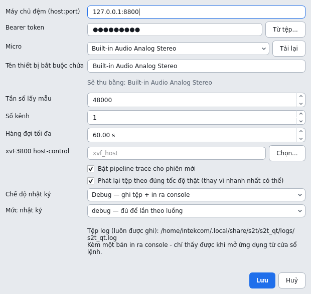

*Đã chọn mic ở ô **Micro**: ô tên tự điền theo, và dòng xám bên dưới nói trước
bấm Ghi âm sẽ thu bằng thiết bị nào. Dòng dưới cùng là đường dẫn tệp log — tệp
luôn được ghi, dù chọn chế độ nào.*

| Mục | Ý nghĩa |
|---|---|
| **Máy chủ đệm (host:port)** | Địa chỉ của `s2t-qt-server`. Trên máy này là **`127.0.0.1:8800`** — server chạy ngay trên cùng máy. **Không phải** địa chỉ tầng suy luận (`:8011`) — xem ghi chú ngay dưới bảng. |
| **Bearer token** | Token xác thực của Server buffer. Bấm **Từ tệp...** để đọc từ tệp thay vì gõ tay. Token của tầng suy luận là việc của server và không nằm ở đây. |
| **Micro** | Thiết bị thu. `(mặc định hệ thống)` để hệ điều hành tự chọn. Nút **Tải lại** đọc lại danh sách sau khi vừa cắm thêm mic. Dòng chữ ngay dưới hai ô này nói trước **sẽ thu bằng mic nào**, hoặc chữ đỏ nếu với lựa chọn hiện tại ghi âm sẽ không bắt đầu được. |
| **Tên thiết bị bắt buộc chứa** | Chuỗi mà tên thiết bị phải chứa. **Tự điền theo mic vừa chọn ở ô trên**; để trống là nhận mọi thiết bị. Cài mới thì mặc định để trống. Máy đã từng lưu `Speaker` (giá trị mặc định cũ) thì vẫn giữ `Speaker` — xem ghi chú dưới bảng. |
| **Tần số lấy mẫu / Số kênh** | Mặc định 48000 Hz, 1 kênh. Phải là định dạng thiết bị hỗ trợ. Server tự hạ về 16 kHz mono trước khi đưa vào AI, nên không cần chỉnh theo AI. |
| **Hàng đợi tối đa** | Số giây audio đã thu nhưng chưa được server xác nhận, được phép tồn đọng ở phía giao diện. Mặc định 60 s. |
| **xvF3800 host-control** | Đường dẫn tới `xvf_host`, dùng cho nút bật/tắt lọc nhiễu phần cứng. **Máy RHEL này không có công cụ đó** — để trống, và mục *Lọc nhiễu* trong menu **Micro** sẽ báo là không dùng được. |
| **Bật pipeline trace** | Không còn tác dụng: từ 2026-09-21 máy chủ thu vết cho mọi phiên, xem ở cửa sổ **Pipeline trace** (`F8`). Xem [mục 7](#7-cửa-sổ-pipeline-trace-và-nghiệm-thu). |
| **Phát lại tệp theo tốc độ thật** | Bật: mô phỏng đúng nhịp cuộc họp (dùng để đo độ trễ). Tắt: xử lý lại một bản ghi càng nhanh càng tốt. |
| **Chế độ nhật ký / Mức nhật ký** | Xem [mục 8](#8-nhật-ký-và-chẩn-đoán). |

Cấu hình được lưu lại và tự nạp ở lần mở sau.

#### Chọn microphone — từng bước

Làm trên màn hình thật của máy RHEL (hoặc AnyDesk vào đúng màn hình đó).

**Bước 1 — Mở ứng dụng**

1. Mở một cửa sổ dòng lệnh (Terminal).
2. Gõ lần lượt, mỗi dòng xong bấm Enter:
   ```bash
   cd ~/s2t-qt
   ./run_s2t.sh client
   ```
   Phải có chữ `client` — gõ trần `./run_s2t.sh` thì đóng ứng dụng là tắt
   luôn server (xem [mục 0](#0-mở-ứng-dụng-trên-máy-rhel)).
3. Đợi cửa sổ chính hiện ra. Đèn ở góc phải thanh công cụ phải là
   **● ĐÃ KẾT NỐI AI** (xanh).

**Bước 2 — Mở hộp thoại Cấu hình**

4. Trên thanh menu bấm **Công cụ**, rồi bấm **Cấu hình...** (dòng cuối). Hoặc
   bấm `Ctrl` + `,`.
5. Nếu máy còn giữ cấu hình cũ, ô **Tên thiết bị bắt buộc chứa** là `Speaker`
   và ngay dưới có dòng chữ **đỏ** *"⚠ Không tìm thấy microphone có tên chứa
   "Speaker". Ghi âm sẽ không bắt đầu được."* (ảnh
   `13-cau-hinh-mic-sai.png` ở ghi chú dưới).

**Bước 3 — Chọn mic**

6. Bấm vào ô **Micro** (dòng thứ 3).
7. Chọn đúng tên mic trong danh sách — trên máy này là **Built-in Audio
   Analog Stereo**. Vừa cắm thêm mic mà chưa thấy tên thì bấm **Tải lại** bên
   phải rồi mở lại danh sách.
8. Kiểm tra hai điều:
   - ô **Tên thiết bị bắt buộc chứa** đã **tự đổi** theo tên mic vừa chọn;
   - dòng chữ bên dưới đã thành dòng **xám** *"Sẽ thu bằng: <tên mic>"*.

   Vẫn còn chữ đỏ thì **đừng bấm Lưu** — chụp màn hình gửi đội phát triển.

**Bước 4 — Lưu**

9. Bấm **Lưu** (nút xanh, góc phải dưới cùng). **Huỷ** là bỏ hết thay đổi.

**Bước 5 — Kiểm tra lại**

10. Mở lại **Công cụ → Cấu hình...**: ô Micro phải còn giữ mic vừa chọn và dòng
    chữ vẫn xám. Bấm **Huỷ** để đóng.
11. Ghi thử: **Ghi âm từ micro** (`Ctrl+R`) → **Bắt đầu ghi âm** → nói vài câu →
    **Dừng phiên** (`Ctrl+.`). Chữ phải hiện trên màn hình.

Chỉ phải làm một lần — lần mở sau ứng dụng tự nạp lại. Nhật ký quy trình
(mục 8) ghi lại việc này thành bước `user.settings`, và từ lần mở sau thì đầu
tệp có dòng *"Bấm Ghi âm sẽ thu bằng: <tên mic>"* — đội phát triển xem tệp là
biết máy đã cấu hình đúng chưa.

> **Điền nhầm cổng thì sao.** Nếu bạn trỏ vào Triton (`:8011`) thay vì Server
> buffer (`:8800`), đèn báo sẽ đỏ kèm câu *"…trả lời nhưng không phải Server
> buffer"*. Đó là lỗi cấu hình, không phải lỗi mạng: cả hai đều nói gRPC,
> nhưng chỉ Server buffer mới trả lời được lệnh `ping` của nó. Bỏ qua bộ đệm
> nghĩa là mất toàn bộ khả năng chịu sự cố mạng mà nó đem lại.

> ### "Tên thiết bị bắt buộc chứa" — chỗ dễ vướng nhất trên RHEL
>
> Ô này là một **bộ lọc theo tên**: ứng dụng chỉ mở microphone nào có tên
> *chứa* chuỗi đó. Bản cũ mặc định là `Speaker`, và máy nào đã lưu cấu hình từ
> bản cũ thì vẫn còn giữ giá trị đó. Trên máy RHEL này tên thiết bị không có
> chữ `Speaker`, nên phiên không mở được, kèm đúng câu:
>
> ```
> Không tìm thấy microphone có tên chứa "Speaker".
> ```
>
> Từ 2026-09-25 hộp thoại Cấu hình báo điều này **ngay khi mở**, bằng dòng chữ
> đỏ dưới ô tên — không phải đợi tới lúc bấm ghi âm:
>
> 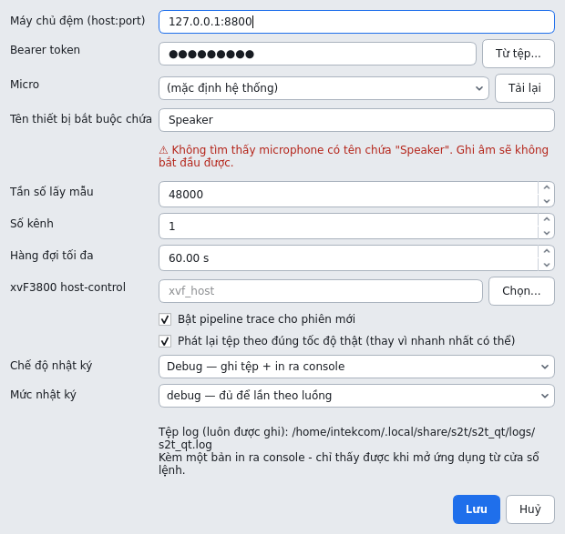
>
> Cách xử lý, theo thứ tự:
>
> 1. Xem hệ điều hành đang gọi mic là gì — mục **Sources**:
>
>    ```bash
>    wpctl status
>    ```
>
>    Trên máy này, mic tích hợp hiện ra là `Built-in Audio Analog Stereo` —
>    không chứa chữ `Speaker`, nên đúng là ca hỏng nói trên.
>
> 2. Cách nhanh nhất: mở **Cấu hình** rồi **chọn lại mic ở ô Micro**, ô tên sẽ
>    tự điền theo và dòng chữ bên dưới báo *"Sẽ thu bằng: …"*. Hoặc tự điền một
>    mẩu tên đủ đặc trưng (ví dụ `Built-in`, `USB`), hoặc để trống ô này nếu
>    máy chỉ có một mic.
>
> Đầu nhật ký quy trình (mục 8) cũng có dòng **"Bấm Ghi âm sẽ thu bằng"**, nên
> gặp ca này ở máy khác thì chỉ cần xem tệp là biết.
>
> **Để trống thì mất gì.** Ràng buộc tên có lý do của nó: khi rút USB mic,
> PipeWire/PulseAudio có thể trao lại đúng chỗ đó cho một thiết bị khác (mic
> tích hợp chẳng hạn), và không có ràng buộc thì ứng dụng lặng lẽ ghi tiếp
> bằng thiết bị sai. Có ràng buộc thì nó dừng lại và nói rõ. Nếu máy có nhiều
> hơn một đầu vào, **nên điền** thay vì để trống.

### 1.2 Bố cục cửa sổ chính

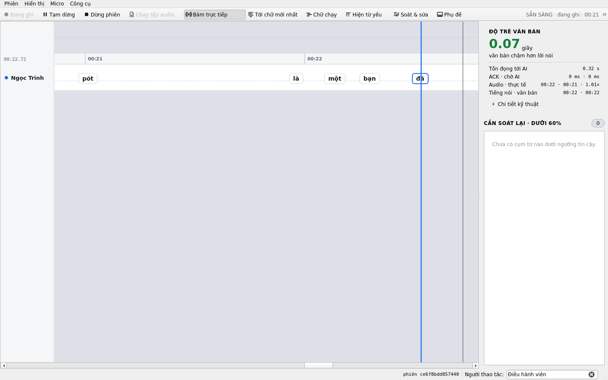

*Ảnh chụp lúc đang chạy lại một tệp mẫu: dải thời gian ở giữa, mỗi người nói
một hàng; cột phải là độ trễ văn bản và danh sách cần soát lại; thanh dưới có
mã phiên và ô Người thao tác. Nếu cửa sổ hẹp hơn thanh công cụ, Qt dồn các nút
cuối vào nút `»` ở góc phải — kéo rộng cửa sổ là chúng hiện lại.*

Cửa sổ được chia theo **ai hỏi câu gì**, không theo loại widget:

| Vùng | Chứa gì |
|---|---|
| **Thanh menu** (trên cùng) | Toàn bộ chức năng, kèm phím tắt. Mọi thứ đều tìm được ở đây, kể cả những cửa sổ không có nút trên thanh công cụ. |
| **Thanh công cụ** | Chỉ những **việc** hay dùng giữa cuộc họp, chia ba nhóm: điều khiển ghi âm · cách hiển thị timeline · hai bảng hay mở. Bên phải là **trạng thái**: tình trạng micro và đèn kết nối. |
| **Giữa** | Timeline bản chép (hoặc chế độ chữ chạy). |
| **Cột phải** | Độ trễ và danh sách cụm từ cần soát lại. |
| **Thanh dưới** | Thông báo, mã phiên, và ô **Người thao tác**. |

Nguyên tắc: thanh **trên** là những gì thay đổi liên tục trong lúc họp; thanh
**dưới** là những gì thay đổi nhiều nhất một lần mỗi cuộc họp.

Phím tắt hay dùng:

| Phím | Việc |
|---|---|
| `Ctrl+R` | Ghi âm từ micro |
| `Ctrl+O` | Chạy tệp audio |
| `Ctrl+P` | Tạm dừng / Tiếp tục |
| `Ctrl+.` | Dừng phiên |
| `Ctrl+L` | Bám trực tiếp theo audio |
| `Ctrl+J` | Nhảy tới chữ mới nhất |
| `Ctrl+T` | Chế độ chữ chạy |
| `Ctrl+W` | Hiện từ độ tin cậy thấp |
| `F5` | Đăng ký giọng nói |
| `F6` | Phụ đề trực tiếp |
| `F7` | Lịch sử hiệu chỉnh |
| `F8` | Pipeline trace |
| `F9` | Bảng soát & sửa |
| `F10` | Nghiệm thu pipeline |
| `F12` | Nhật ký & chẩn đoán |
| `Ctrl+,` | Cấu hình |

### 1.3 Tên người thao tác

Ô **Người thao tác** ở **góc phải thanh dưới** cửa sổ. **Phải nhập lại mỗi lần
mở ứng dụng** — đây là cố ý: tên này được ghi vào nhật ký kiểm toán như người
chịu trách nhiệm cho mỗi lần sửa. Một ô tự điền lại tên người dùng máy lần
trước sẽ ghi công việc của người này dưới tên người khác.

Không có tên người thao tác thì không sửa được văn bản và không đăng ký được
giọng nói.

### 1.4 Kiểm tra kết nối

Đèn báo ở **góc phải thanh công cụ** tự cập nhật mỗi 3 giây. Nó có **ba** trạng thái,
không phải hai, vì giờ có hai chặng mạng và hai chặng ấy hỏng theo hai cách
khác nhau — cần hai cách xử lý khác nhau:

| Đèn | Nghĩa | Cần làm gì |
|---|---|---|
| **● ĐÃ KẾT NỐI AI** (xanh) | Server buffer trả lời, token được chấp nhận, và **nó** tới được tầng suy luận. | Không. |
| **● ĐANG ĐỆM** (vàng) | Server buffer vẫn trả lời bình thường, nhưng nó chưa tới được tầng suy luận. | **Cứ ghi tiếp.** Audio vẫn được nhận và xếp hàng trên server; chữ sẽ hiện ra khi tầng suy luận trở lại. Báo cho người quản trị. |
| **● MẤT KẾT NỐI** (đỏ) | Không tới được Server buffer, hoặc token sai. | Xem [mục 9](#9-xử-lý-sự-cố). Ghi tiếp cũng chỉ dồn hàng đợi trên máy này, và hàng đợi đó có giới hạn. |

Đèn xanh nghĩa là server *trả lời được một RPC thật*, không chỉ là mở được TCP.

Di chuột lên đèn để thấy chi tiết đầy đủ: địa chỉ, phiên bản Server buffer, và
tình trạng tầng suy luận.

---

## 2. Ghi âm một cuộc họp

### 2.1 Bắt đầu

1. Bấm **Ghi âm từ micro** (`Ctrl+R`).
2. Trong hộp thoại, điền phần siêu dữ liệu (đều tùy chọn):
   - **Tên phiên**, **Người tham gia** (cách nhau bằng dấu phẩy).
   - **Mức bảo mật** — chỉ lưu nhãn, *không* thay cho phân quyền phía server.
   - **Chế độ**: `Ghi âm + chuyển văn bản` hoặc `Chỉ ghi âm (không chạy AI)`.
     "Chỉ ghi âm" là một lời hứa chứ không phải một nhãn: phiên đó **không hề
     gọi** tầng suy luận, nên nó không tốn GPU và bản chép trả về rỗng — đó là
     câu trả lời đúng, không phải lỗi.
3. Chọn phạm vi nhận diện người nói:
   - **Không giới hạn** — so khớp với toàn bộ database giọng nói chung.
   - **Chỉ những người được chọn** — tick tên trong danh sách bên dưới.
4. Bấm **Bắt đầu ghi âm**.

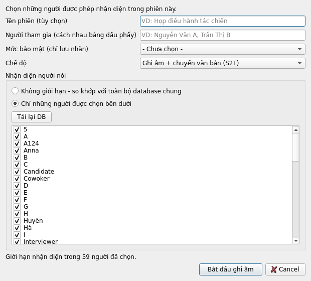

*Danh sách bên dưới là toàn bộ giọng đã đăng ký trên hệ thống (ảnh chụp lúc có
59 giọng). Nút **Tải lại DB** đọc lại danh sách mà không phải đóng hộp thoại.*

> **Ba trạng thái, không phải hai.** "Không giới hạn" là so khớp toàn bộ DB.
> "Chỉ những người được chọn" mà **không tick ai** là một chỉ thị khác hẳn:
> *không gán tên đã đăng ký nào cả*. Nó không quay về nghĩa thứ nhất.

Ứng dụng mở microphone **trước**, rồi mới tạo phiên trên server. Nếu thiết bị
không mở được thì bạn nhận lỗi "không ghi được", chứ không phải một phiên rỗng
nằm treo trên server.

### 2.2 Trong lúc ghi

| Nút | Phím | Tác dụng |
|---|---|---|
| **Tạm dừng** | `Ctrl+P` | Ngừng gửi audio, **không** kết thúc phiên. Lời nói trong lúc tạm dừng bị bỏ ngay lúc thu — không được gửi bù sau khi tiếp tục. Bấm lại (nút đổi thành **Tiếp tục**) để chạy tiếp. |
| **Dừng phiên** | `Ctrl+.` | Kết thúc phiên: gửi nốt audio còn trong hàng đợi rồi chốt bản chép. |
| **Bám trực tiếp** | `Ctrl+L` | Timeline tự cuộn theo audio đang tới. Cuộn tay sẽ tự tắt nó, và nút đổi nhãn thành **Đang xem lại**. |
| **Tới chữ mới nhất** | `Ctrl+J` | Nhảy tới từ mới nhất đã nhận được. |
| **Chữ chạy** | `Ctrl+T` | Chuyển sang chế độ một dòng chữ chạy, chữ to. |
| **Hiện từ yếu** | `Ctrl+W` | Mặc định các từ dưới ngưỡng tin cậy bị ẩn. Bật để xem tất cả. |

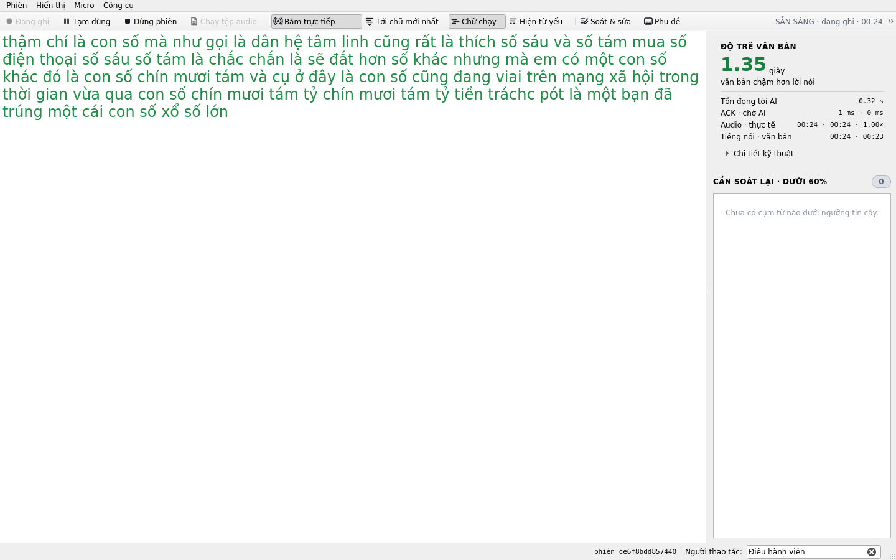

*Chế độ **Chữ chạy** (`Ctrl+T`): bỏ dải thời gian, chỉ còn văn bản cỡ lớn để
chiếu lên màn hình chung. Cột phải vẫn giữ nguyên.*

**Bấm vào một từ trên dải thời gian là sửa được ngay câu chứa từ đó** — không
phải mở bảng Soát & sửa. Hộp thoại hiện câu đó tách theo từng token; token nào
nằm sau **mốc chốt** thì xem được nhưng chưa sửa được, vì một lượt hiệu chỉnh
sau vẫn có thể viết lại nó (server trả `edit_range_not_committed`). Việc sửa
cần **tên người thao tác** như mọi chỗ khác.

Lọc nhiễu phần cứng của mic (cần `xvf_host`) nằm ở menu **Micro** — nó được đặt
một lần cho cả buổi chứ không phải thứ bật tắt liên tục, nên không chiếm chỗ
trên thanh công cụ.

**Cột phải** trả lời hai câu hỏi, theo thứ tự:

1. **Độ trễ văn bản** — một con số lớn: chữ đang chậm hơn lời nói bao nhiêu
   giây. Xanh dưới 1.5 s, vàng tới 4 s, đỏ trên đó. Ngay dưới là bốn dòng nói
   thời gian đang trôi đi đâu: tồn đọng tới AI (hàng đợi máy này + hàng đợi
   server), thời gian ACK và chờ AI, tiến độ audio so với đồng hồ, và mốc
   tiếng nói so với mốc văn bản.
2. **Cần soát lại** — các cụm từ mô hình tự đánh giá dưới ngưỡng tin cậy, kèm
   mốc thời gian, người nói và phần trăm. Đây là danh sách việc cần làm ở bảng
   **Soát & sửa**.

Các số phân vị của máy chủ và của máy này, cùng bộ đếm của mô hình bản chép,
nằm sau nút **Chi tiết kỹ thuật** — cần khi báo lỗi, không cần lúc điều hành.

### 2.3 Kết thúc

Bấm **Dừng phiên**. Thanh trạng thái hiện "Đang kết thúc: gửi nốt audio và flush
correction...". Bước này có thể mất từ vài giây đến vài phút — server còn phải
xử lý hết phần audio đã nhận. Đừng đóng ứng dụng trong lúc này.

Xong sẽ có thông báo kèm mã phiên, thời lượng và số revision.

---

## 3. Chạy lại một tệp audio hoặc video

Bấm **Chạy tệp audio** (`Ctrl+O`), khai báo siêu dữ liệu và phạm vi người nói giống mục 2, rồi chọn
tệp. Nhận cả **video**: `.wav .m4a .mp3 .aac .flac .ogg .mp4 .mkv .mov .avi`.

- Tệp không phải WAV PCM 16-bit được giải mã tự động. Nếu máy có `ffmpeg` trên
  PATH thì dùng nó; nếu không thì dùng **FFmpeg đi kèm Qt Multimedia**, nên
  **không cần cài thêm gì** — và máy RHEL này đúng là không có `ffmpeg` trên
  PATH. Với video, chỉ luồng tiếng được lấy.
- Mọi nguồn đều được đưa về **16 kHz mono** trước khi gửi, vì
  `asr_diar_session` nhận một tensor float không kèm nhịp lấy mẫu và mặc định
  coi mọi thứ là 16 kHz — đưa 48 kHz vào thì bản chép nghe trôi chảy nhưng sai
  hoàn toàn, chứ không báo lỗi.
- Tốc độ phát lại theo tùy chọn **Phát lại tệp theo tốc độ thật** trong Cấu hình.

Tệp đi qua **đúng pipeline** như microphone, nên đây là cách tái hiện một sự cố
mà không cần dựng lại cuộc họp.

Cả tệp được giải mã vào bộ nhớ **trước** khi phiên bắt đầu, nên cửa sổ đứng im
vài giây với tệp dài — đo trên máy RHEL: một video họp 88 phút (736 MB) mất
**3,2 giây** và chiếm 170 MB. Muốn *vừa xem hình vừa xem phụ đề* thì dùng cửa
sổ ở [mục 4](#4-phụ-đề-trực-tiếp) chứ không phải mục này.

---

## 4. Phụ đề trực tiếp

**Hiển thị → Phụ đề** (`F6`) mở một cửa sổ riêng: một bên là hình (hoặc micro),
một bên là bản chép đang chạy theo đồng hồ phát.

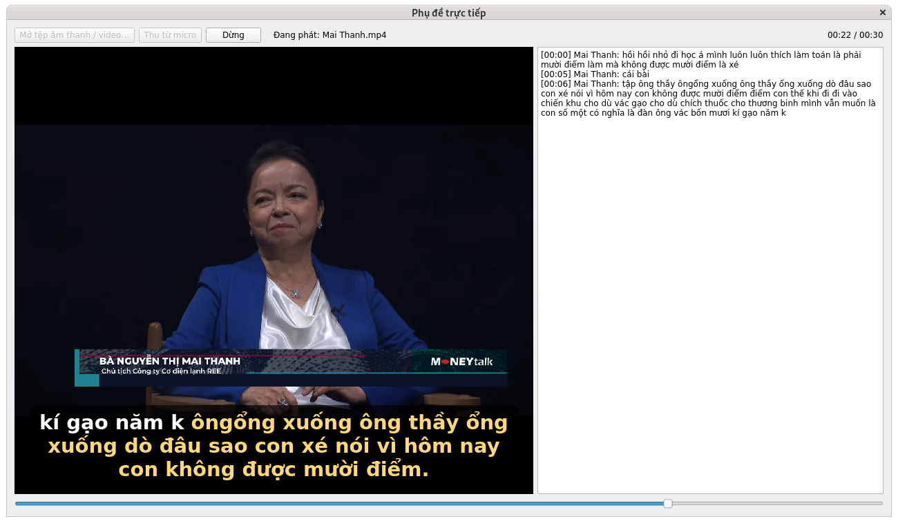

*Ảnh chụp màn hình thật trên máy RHEL, giây thứ 22 của một tệp mẫu: hình chạy
bên trái với phụ đề đè lên, bản chép cuộn bên phải kèm tên người nói đã đăng
ký. **Chữ trắng là phần đã chốt, chữ vàng là mép còn đang thay đổi** — phần
vàng có thể được viết lại khi mô hình chốt tới đó.*

Nguồn chỉ có tiếng (`.wav`, `.mp3`, hoặc micro) thì chỗ hình là một nền tối,
phụ đề vẫn chạy đúng chỗ đó:

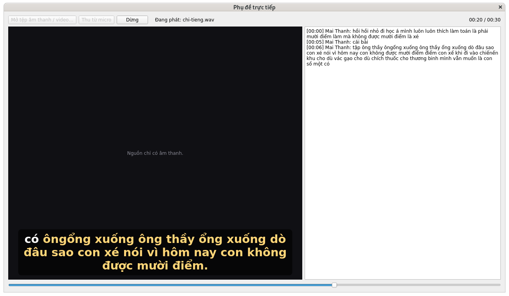

Hai nút để bắt đầu:

| Nút | Làm gì |
|---|---|
| **Mở tệp âm thanh / video…** | Chọn `.wav .mp3 .m4a .aac .flac .ogg .mp4 .mkv .mov .avi`. Tệp có hình thì hiện hình; tệp chỉ có tiếng thì hiện nền tối, phụ đề vẫn ở nguyên chỗ đó. |
| **Thu từ micro** | Cùng đường đi như **Ghi âm từ micro** ở cửa sổ chính, chỉ khác cách hiển thị. |

**Điều làm cửa sổ này khác cửa sổ chính:** chữ được đặt theo **đồng hồ phát**,
không phải theo thứ tự trả về. Mỗi từ server trả về đều có mốc bắt đầu và kết
thúc, nên câu hỏi đúng là *"lúc này trong phim đang nói gì"* chứ không phải
*"vừa nhận được gì"*. Nhờ vậy phụ đề không trôi đi khi pipeline nhanh hoặc chậm
hơn thời gian thực.

- **Audio luôn được đẩy theo tốc độ thật**, kể cả khi tuỳ chọn *Phát lại tệp
  theo tốc độ thật* đang tắt. Vì vậy **tua tới trước thì chưa có phụ đề** —
  phần đó chưa kịp gửi lên; tua lùi thì có đủ.
- Tên người nói trong khung bản chép là tên đã **đăng ký giọng** (mục 6). Giọng
  chưa đăng ký hiện là *Người 1*, *Người 2*…
- Bấm **Dừng** để kết thúc phiên. Đóng cửa sổ không kết thúc phiên.
- Cửa sổ đổi cỡ tự do và tách rời cửa sổ chính, để kéo sang màn hình thứ hai
  hoặc máy chiếu (dùng nút phóng to của hệ điều hành để chiếm cả màn hình).

Đây cũng là cách trình diễn hệ thống gọn nhất: một tệp có sẵn, một cửa sổ, và
toàn bộ đường đi thật — client → Server buffer → tầng suy luận → chữ. Xem
[phụ lục A](#phụ-lục-a--chạy-trên-máy-rhel-và-bộ-mẫu-demo) nếu đang demo trên
máy RHEL.

---

## 5. Soát lại và sửa bản chép

Bấm **Soát & sửa** (`F9`) để mở bảng soát lại ở đáy cửa sổ.

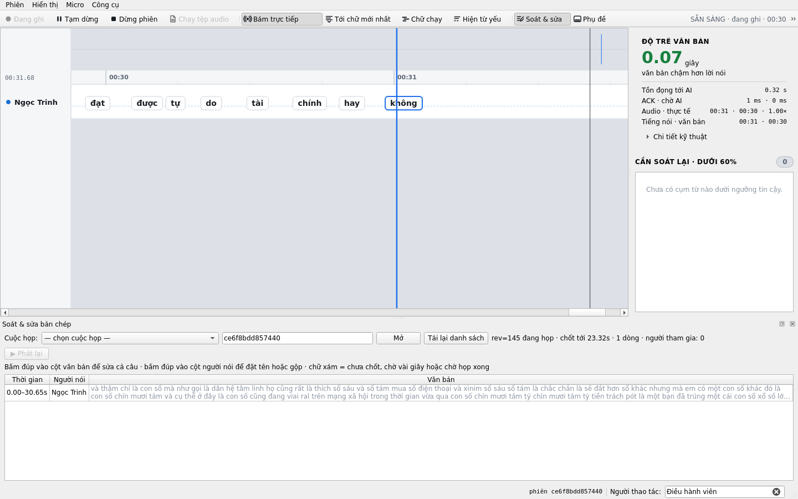

*Dòng đầu của bảng cho biết đang xem phiên nào, `rev=` bao nhiêu, đã **chốt tới
giây thứ mấy** và có mấy dòng. Chữ xám là phần chưa chốt — sửa chỗ đó sẽ bị từ
chối, đợi vài giây là chốt tới.*

> **Với cuộc họp dài, đây là nơi duy nhất xem được toàn văn.** Khung bản chép
> đang chạy chỉ giữ **15 phút gần nhất** (và tối đa 180 dòng), để một cuộc họp
> nhiều giờ không làm chương trình phình ra vô hạn. Đoạn trôi quá mốc đó không
> mất — nó nằm đủ trên máy chủ — nhưng phải mở Soát & sửa mới thấy, cuộn khung
> đang chạy thì không ra. Muốn lấy cả cuộc họp thành một tệp thì dùng
> `tools/export_transcript.py`, nó xuất `.txt` và `.docx` đã gộp theo người nói.

- **Tải danh sách** rồi chọn phiên; hoặc gõ thẳng `session_id`.
- **Sửa một câu**: bấm đúp vào ô văn bản, sửa, xác nhận.
- **Đổi tên người nói**: bấm đúp vào ô người nói. Có thể đặt tên hiển thị hoặc
  gộp vào một speaker khác.
- **Nghe lại**: bấm đúp vào ô thời gian để phát đúng đoạn audio quanh đó.

Mỗi lần sửa đều mang theo `base_revision`. Nếu server đã nhích revision từ lúc
bạn tải về, chỉnh sửa sẽ bị từ chối và bảng tự tải lại — không có chuyện ghi đè
âm thầm lên việc của người khác.

Nếu nhận được *"chưa chốt tới đoạn này, thử lại sau vài giây"*: đoạn đó vẫn còn
là kết quả tạm, chưa chốt. Đợi vài giây rồi sửa lại.

- **Bản sửa lúc đang họp được giữ.** Một từ đã sửa tay thì lượt hiệu chỉnh tự
  động đến sau không ghi đè lên nó nữa (trước 2026-09-24 thì có).
- **Bản sửa được ghi xuống kho ngay**, nên nó còn nguyên sau khi server khởi
  động lại hay sau khi phiên rời bộ nhớ.
- **Phiên cũ đã đóng từ lâu vẫn sửa và đổi tên được.** Sau khi họp xong, sửa
  được toàn bộ bản chép, không còn giới hạn mốc chốt.
- Mọi lần sửa và đổi tên đều **bắt buộc có tên người thao tác**; thiếu thì
  server từ chối.

Menu **Công cụ → Lịch sử hiệu chỉnh** (`F7`) xem toàn bộ nhật ký kiểm toán của phiên: ai sửa gì, lúc nào.

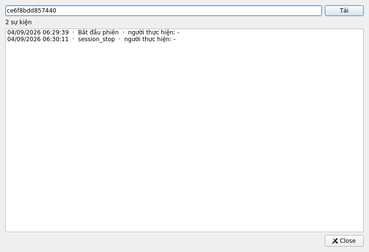

*Không chỉ có các lần sửa: mốc bắt đầu và dừng phiên cũng nằm ở đây. Cột cuối
là `editor_id` — dấu `-` nghĩa là việc đó do hệ thống làm, không phải người.*

---

## 6. Đăng ký giọng nói

Menu **Phiên → Đăng ký giọng nói** (`F5`). Cần có tên người thao tác.

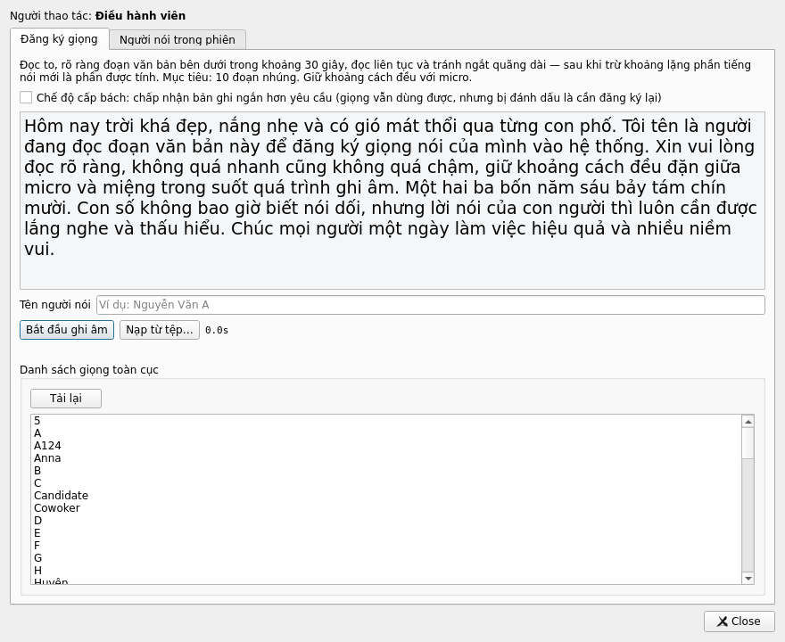

*Đoạn văn mẫu do server cấp, không phải chữ cố định trong ứng dụng. Ô **Chế độ
cấp bách** chấp nhận bản ghi ngắn hơn yêu cầu — giọng vẫn dùng được nhưng bị
đánh dấu là nên đăng ký lại, nên chỉ dùng khi thật sự không thu lại được.*

**Đăng ký giọng mới — thu trực tiếp:**
1. Nhập tên hiển thị.
2. Đọc to đoạn văn mẫu hiện trên màn hình, bấm ghi rồi dừng.
3. Bản ghi được chuyển về 16 kHz mono và gửi lên; server chạy VAD, trích
   embedding và cập nhật DB. Bước này có thể mất tới 2 phút.

**Hoặc nạp từ tệp có sẵn:** bấm **Nạp từ tệp…**. Nhận cả `.wav`, `.mp3`,
`.m4a` lẫn video `.mp4` — phần mềm tự tách tiếng và chuyển về 16 kHz mono, nên
không cần chuẩn bị gì trước.

> **Mẫu tốt quan trọng hơn mẫu dài.** Đoạn phải là **một người nói, liên tục,
> không nhạc nền**. Một tệp có hai người nói sẽ tạo ra một "giọng" pha trộn, và
> sau đó hệ thống gán nhầm tên cho người khác trong các cuộc họp thật — hỏng âm
> thầm, rất khó lần ra. Nếu dùng video quay họp, hãy cắt đúng đoạn một người
> nói trước khi nạp.
>
> Sau khi gửi, hãy đọc dòng kết quả: `speech_seconds_after_vad` cho biết thực
> sự có bao nhiêu giây là tiếng nói. Nếu nó nhỏ hơn nhiều so với độ dài tệp thì
> mẫu có nhiều khoảng lặng — nên thu lại.
>
> **Đặt mục tiêu 30–40 giây tiếng nói**, không phải 20. Ngưỡng của server là 20
> giây *sau khi trừ khoảng lặng*, nên một bản đọc 20 giây thường chỉ còn hơn 19
> giây và rơi vào chế độ cấp bách. Đo trên máy thật: 30–59 giây đọc liên tục thì
> qua sạch, không cảnh báo nào.

> Nếu mạng rớt giữa lúc gửi, **bản ghi vẫn nằm trong cửa sổ** — đừng đóng. Có
> mạng lại thì bấm **Gửi lại bản ghi**.

> Nếu bấm mà báo *"chưa cấu hình dịch vụ đăng ký giọng"*, đó là chuyện của máy
> chủ chứ không phải của bạn: khoá `enroll/url` trong `/etc/s2t-qt-server.conf`
> đang để trống. Báo người quản trị.

**Nghe thử trước khi đăng ký.** Nút **Nghe thử (không ghi vào DB)** cắt mẫu
đúng như lúc đăng ký thật rồi phát lại phần còn lại, nhưng **không ghi gì cả**
— không thêm giọng, không sửa DB, không để lại dấu vết. Nó cho biết ngay hai
điều:

- còn bao nhiêu giây tiếng nói sau khi cắt khoảng lặng (con số ngưỡng 20 giây
  tính trên số này, không phải trên độ dài tệp);
- và quan trọng hơn: **nghe ra có đúng một người nói không.**

Hãy dùng nó mỗi lần, nhất là khi nạp từ tệp quay họp. Đăng ký là thao tác
không hoàn tác được từ ứng dụng, còn hai người trong một mẫu thì không báo lỗi
gì — nó chỉ lặng lẽ gọi sai tên ở các cuộc họp sau.

### Dọn DB giọng chung

Tab **DB giọng chung** liệt kê mọi giọng trong DB dùng chung, kể cả các giọng
đã ngưng dùng hoặc đã xoá. Đây chính là danh sách mà hệ thống đem ra so khớp
với từng cuộc họp, nên một giọng rác trong đó là một cái tên sai chờ sẵn.

Chọn một dòng, nhập **lý do**, rồi:

| Nút | Làm gì | Lấy lại được không |
|---|---|---|
| **Ngưng dùng** | Giọng thôi được đem ra so khớp, vẫn còn trong DB | Được — bấm **Dùng lại** |
| **Dùng lại** | Đưa một giọng đã ngưng trở lại | — |
| **Xoá vĩnh viễn…** | Gỡ hẳn khỏi DB | **Không, từ ứng dụng thì không** |

> **Gần như lúc nào cũng nên dùng "Ngưng dùng" thay vì xoá.** Kết quả nhìn
> thấy được là như nhau — giọng không còn được gán cho ai nữa — nhưng một cái
> thì bấm một nút là quay lại được, cái kia thì phải nhờ người quản trị khôi
> phục thủ công trên máy chủ. Vì vậy **Xoá vĩnh viễn** bắt gõ lại đúng `spk_id`
> để xác nhận.
>
> Lý do là bắt buộc với ngưng dùng và xoá, và nó được ghi nhật ký kèm tên người
> thao tác — sáu tháng sau đó là thứ duy nhất trả lời được câu "ai gỡ giọng này
> và vì sao".
>
> Nếu kết quả báo *"Không có gì thay đổi"* thì giọng vốn đã ở trạng thái đó rồi;
> đấy không phải lỗi.

**Gán giọng cho một phiên:** ở phần *Người nói trong phiên*, mỗi speaker phát hiện
được trong phiên có thể để nguyên, gán vào một người đã có trong DB, hoặc tạo
mới. Bấm **Lưu lựa chọn**. Từng speaker được báo kết quả riêng — một cái lỗi
không kéo theo các cái còn lại.

> **Phải dừng phiên trước đã.** Danh sách người nói của phiên và các đoạn audio
> làm bằng chứng cho từng người chỉ được chốt ở lúc `stop_session` — tầng suy
> luận chỉ xuất kết quả phân cụm giọng ở đúng nhịp cuối cùng. Một cuộc họp còn
> đang ghi thì phần này trống, và đó không phải lỗi.
>
> **Bằng chứng chỉ được ghim cho giọng mà người soát đã đổi tên.** Muốn đẩy một
> giọng lên DB chung thì trình tự là:
>
> 1. **Trong lúc họp, trước khi bấm Dừng phiên**, đổi tên người nói đó ở bảng
>    Soát & sửa (`F9`) — bấm đúp ô người nói, gõ tên thật.
> 2. **Dừng phiên.** Đúng lúc này, và chỉ lúc này, hệ thống chọn các đoạn dài
>    nhất mà **chỉ một mình** người đó nói, cộng lại tối đa 45 giây, bỏ qua
>    tiếng đế dưới một giây.
> 3. Mở `F5` → *Người nói trong phiên*, chọn đẩy lên DB chung, **Lưu lựa chọn**.
>
> Giọng mà **không ai đổi tên** — kể cả khi mô hình đã tự gán một cái tên cho
> nó — thì không có bằng chứng nào và không đẩy lên được. Đây là cố ý (sửa
> ngày 2026-09-24): trước đó hệ thống tự ghim cho tên do mô hình gán, không ai
> duyệt, và có lúc lấy nhầm giọng của người A làm mẫu cho người B. Một mẫu
> sai trong DB chung là một cái tên sai ở mọi cuộc họp sau.
>
> **Đổi tên sau khi đã dừng phiên thì chỉ đổi chữ hiển thị**, không ghim được
> bằng chứng: hệ thống chỉ biết đoạn nào thuộc cụm giọng nào ở đúng nhịp cuối
> của phiên. Quên đổi tên trước khi dừng thì giọng đó không đẩy lên DB chung từ
> phiên này được — dùng **Đăng ký giọng mới** ở trên (thu trực tiếp hoặc nạp
> từ tệp) thay thế.
>
> Vì vậy gặp câu *"giọng này chưa có bằng chứng nào được ghim - hãy dùng
> rename_speaker…"* thì nghĩa đúng như chữ: **chưa ai đổi tên giọng đó trước
> khi dừng phiên**. Không phải lỗi máy chủ.
>
> Nếu publish báo lỗi vì tên đó **đã từng bị xoá** khỏi DB chung: dịch vụ đăng
> ký không nhận lại tên đã xoá. Dùng một tên khác, hoặc nhờ quản trị khôi phục.

---

## 7. Cửa sổ Pipeline trace và Nghiệm thu

**Pipeline trace** (`F8`) — xem từng chặng pipeline đã nhận gì và làm gì với nó, theo số thứ tự
sự kiện. Hai chế độ tách bạch: *realtime* chỉ giữ các thẻ mới nhất (không phình
theo thời gian), *lịch sử* lật ngược về quá khứ theo trang. Nghe lại được audio
thô của từng sự kiện và ghép nhiều span để nghe liền.

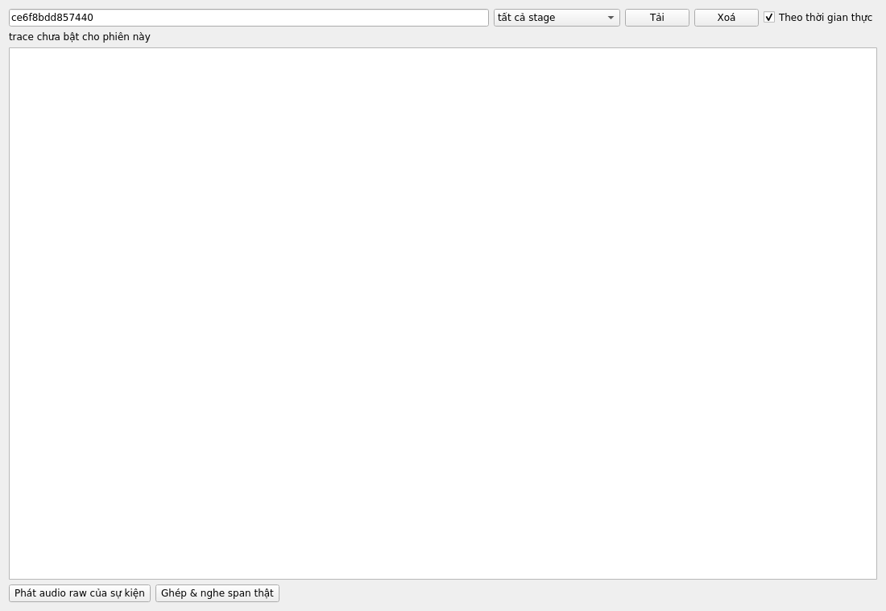

> **Từ 2026-09-21 cửa sổ này có dữ liệu thật.** Ảnh trên chụp trước thay đổi
> đó, nên nó còn hiện dòng *"trace chưa bật cho phiên này"*.
>
> Không cần bật gì ở Cấu hình nữa: vết được thu cho **mọi** phiên, miễn là máy
> chủ có kho phiên (`[session] dir`). Nếu máy chủ chạy không kho thì cửa sổ vẫn
> trống và đó là đúng — không có chỗ để ghi.
>
> Ba loại thẻ sẽ thấy:
>
> - `correction_asr` — cửa sổ audio mà mô hình ASR đã nghe để sửa lại một đoạn
> - `itn` — lượt thêm dấu câu: vào gì, ra gì
> - `streaming_window` — cùng câu hỏi nhưng cho phần chữ đang chạy ở mép
>
> Khi báo "câu này sai dấu", **kèm theo số thứ tự sự kiện `correction_asr`
> quanh thời điểm đó** thì bên pipeline lần ra được ngay cửa sổ nào đã quyết
> định sai. Không có nó thì chỉ còn cách dựng lại cả phiên bằng tay.
>
> Mỗi phiên giữ **2000 sự kiện gần nhất cho mỗi loại thẻ**, tính riêng từng
> loại — nên `streaming_window` (ra nhiều nhất) không còn đẩy mất các thẻ
> `correction_asr`/`itn` của một cuộc họp dài như trước 2026-09-24. Cuộc họp
> rất dài vẫn rụng dần phần đầu của từng loại.

**Nghiệm thu pipeline** (`F10`) — bằng chứng để nghiệm thu hệ thống:

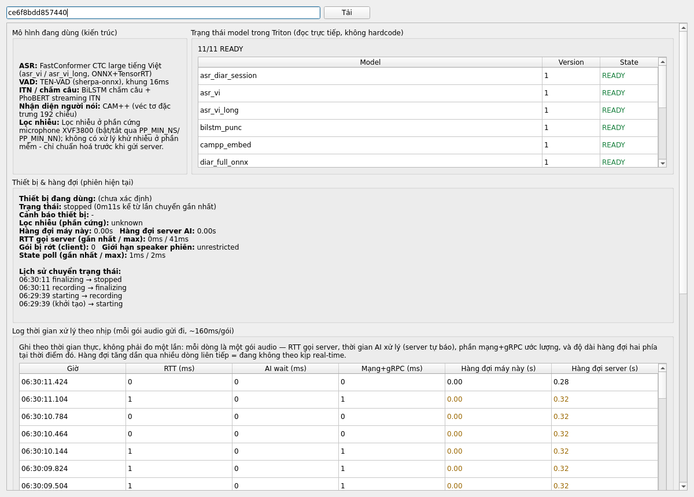

- **Mô hình đang dùng** — kiến trúc và version model phía server. Bảng bên phải
  **đọc thẳng từ Triton lúc bấm**, không phải chữ viết sẵn: ảnh trên là 11/11
  model `READY`, gồm `asr_diar_session`, `asr_vi`, `asr_vi_long`, `bilstm_punc`,
  `campp_embed`, `diar_full_onnx`…
- **Thiết bị & hàng đợi** — lịch sử chuyển trạng thái mic của phiên hiện tại và
  biểu đồ độ trễ: RTT, thời gian chờ AI, phần mạng + gRPC, hàng đợi hai phía.
- **Log thời gian xử lý theo nhịp** — mỗi dòng là một gói audio (~160 ms): RTT,
  thời gian AI, phần mạng + gRPC, và độ dài hàng đợi hai phía *tại đúng lúc đó*.
  Nhiều dòng liên tiếp mà hàng đợi tăng dần = đường ống không theo kịp thời gian
  thực.
- **Bằng chứng lọc nhiễu** — ghi ~7 giây đối chứng tắt/bật lọc nhiễu để nghe so
  sánh. Phải dừng phiên mic trước.
- **VAD / Segment**, **CAM++ verify**, **Người nói trong phiên** — tra theo `session_id`.

---

## 8. Nhật ký và chẩn đoán

> ### Nếu chỉ cần gửi một tệp về cho đội phát triển: gửi **nhật ký quy trình**
>
> Mỗi lần chạy, ứng dụng tự tạo một tệp ghi lại **từng bước đã làm**, theo thứ
> tự, kèm môi trường máy đang chạy. Không phải bật gì cả.
>
> - **Tên tệp**: `quy-trinh-s2t-qt-client-<ngày>-<giờ>-<pid>.log`
>   (nửa máy chủ: `quy-trinh-s2t-qt-server-<cổng>-...`, tức là
>   `quy-trinh-s2t-qt-server-8800-...` cho server thật trên máy này).
>
>   Cổng nằm trong tên vì **server thử nghiệm ghi vào cùng thư mục**: bộ nghiệm
>   thu dùng cổng 8801, `tools/restart_check.py` dùng 18877. Mỗi cổng giữ 40
>   tệp của riêng nó. Trước 2026-09-26, 40 tệp là giới hạn chung, nên một lượt
>   chạy bộ nghiệm thu đẩy mất hết nhật ký của server thật. Tệp tên
>   `quy-trinh-s2t-qt-server-<ngày>-...` (không có cổng) là của bản cũ hơn.
> - **Chỗ để tệp** trên máy RHEL này:
>   - giao diện: `~/.local/share/s2t/s2t_qt/logs/`
>   - Server buffer: `~/.local/share/s2t/s2t-qt-server/logs/`
>
>   Trong giao diện, mở **Công cụ → Nhật ký & chẩn đoán** (`F12`): dòng đầu
>   tab *Nhật ký* ghi sẵn đường dẫn, nút **Mở thư mục log** mở đúng thư mục.
>   Lấy nhanh tệp mới nhất của **từng nửa** từ dòng lệnh:
>
>   ```bash
>   ls -t ~/.local/share/s2t/s2t_qt/logs/quy-trinh-*.log                  | head -1
>   ls -t ~/.local/share/s2t/s2t-qt-server/logs/quy-trinh-s2t-qt-server-8800-*.log | head -1
>   ```
>
>   Với server, **ghi rõ `-8800-`**: gõ trần `quy-trinh-*.log` thì tệp mới nhất
>   có thể là của một server thử nghiệm.
> - **Gửi tệp mới nhất** — mỗi lần mở ứng dụng là một tệp mới, nên tệp có giờ
>   trùng với lúc xảy ra sự cố chính là tệp cần gửi. Ứng dụng giữ 40 tệp gần
>   nhất rồi tự xoá dần.
>
> Tệp đó đọc được bằng Notepad và có ba phần:
>
> ```
> === MÔI TRƯỜNG ===      máy nào, bản nào, cấu hình gì, mic nào
> === CÁC BƯỚC ĐÃ CHẠY === từng thao tác và từng sự cố, kèm giờ
> === KẾT THÚC ===        vì sao dừng
> ```
>
> Phần **MÔI TRƯỜNG** của giao diện có thêm hai khối: **CẤU HÌNH ĐANG CHẠY**
> (token chỉ ghi *đã đặt* / *CHƯA ĐẶT*, không bao giờ ghi giá trị, nên gửi tệp
> đi được) và **THIẾT BỊ THU ÂM** (mọi mic hệ điều hành báo, và dòng *"Bấm Ghi
> âm sẽ thu bằng"*). Mỗi lần bấm lưu **Cấu hình** giữa chừng là một bước
> `user.settings` ghi lại đúng những mục đã đổi.
>
> **Không có mục `=== KẾT THÚC ===` ở cuối nghĩa là tiến trình bị giết hoặc bị
> sập** — đó cũng là một thông tin, nên đừng cắt bớt tệp trước khi gửi. Bị tắt
> có trật tự (đăng xuất, tắt máy, `kill`, `run_s2t.sh stop`) thì *có* mục
> KẾT THÚC, với lý do *"bị tắt bằng tín hiệu SIGTERM"*: đó không phải sự cố.
>
> Bên cạnh nó còn nhật ký kỹ thuật chi tiết (từng lệnh gRPC, từng khung
> HTTP/2): `s2t_qt.log` của giao diện, và `s2t_qt-8800.log` của server thật
> (`run_s2t.sh` đặt tên theo cổng, cùng lý do như trên). Gửi kèm nếu đội phát
> triển hỏi tới; chúng luôn được ghi và tự xoay vòng ở 8 MB.
>
> `~/.local/share/s2t-qt-server/logs/server.log` giờ chỉ còn phần in ra lúc
> server khởi động và các lỗi nghiêm trọng in thẳng ra stderr. Nó được xoay
> vòng mỗi lần khởi động khi vượt 10 MB (bản cũ là `server.log.1`). Trước
> 2026-09-26 mọi dòng log đều bị chép thêm vào đây và tệp không bao giờ bị cắt
> — trên máy này nó đã lên 604 MB.
>
> **Sự cố thường cần cả hai nửa.** Giao diện và Server buffer ghi nhật ký riêng
> nhưng cùng một mã phiên, nên ghép lại mới thành câu chuyện đầy đủ. Đóng gói
> cả hai bằng một lệnh:
>
> ```bash
> tar -czf ~/nhat-ky-s2t-$(date +%Y%m%d-%H%M).tar.gz \
>     -C ~/.local/share/s2t s2t_qt/logs s2t-qt-server/logs
> ```

Menu **Công cụ → Nhật ký & chẩn đoán** (`F12`) mở cửa sổ *Nhật ký & Chẩn đoán*.

### 8.1 Tab Nhật ký

Xem trực tiếp mọi việc ứng dụng đang làm.

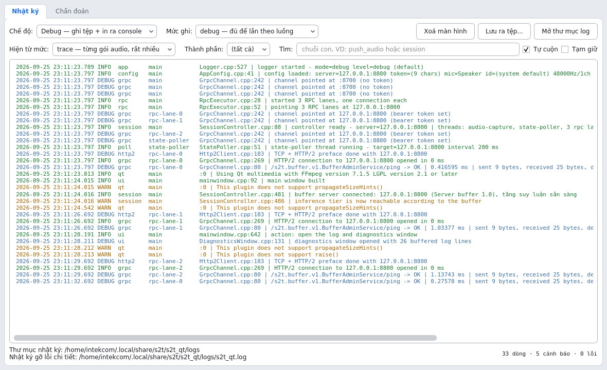

*Mỗi dòng gRPC ghi rõ phương thức, kết quả, thời gian và số byte hai chiều —
đủ để trả lời "chậm ở đâu" mà không cần bắt gói mạng. Góc dưới bên phải đếm số
dòng, số cảnh báo và số lỗi đang có trong bộ đệm.*

- **Chế độ** — quyết định có in kèm ra console hay không. **Tệp thì luôn được
  ghi ở cả hai chế độ**: *Debug — ghi tệp + in ra console* (bản console chỉ
  thấy nếu mở ứng dụng từ cửa sổ lệnh); *Develop — chỉ ghi tệp*. Trước
  2026-09-25, `Debug` không ghi tệp nào cả — nghĩa là mặc định không có gì để
  gửi về khi có sự cố — và nhãn cũ *"Debug — in ra console"* vẫn còn nói như
  vậy cho tới bản 2026-09-25 tối.
- **Mức ghi** — quyết định dòng nào được ghi:

  | Mức | Dùng khi |
  |---|---|
  | `trace` | Đang tái hiện lỗi. Ghi từng gói audio — rất nhiều. |
  | `debug` | Mặc định. Đủ để lần theo luồng hoạt động. |
  | `info` | Chỉ các mốc chính. |
  | `warn` / `error` | Chỉ cảnh báo / chỉ lỗi. |

- **Hiện từ mức**, **Thành phần**, **Tìm** — lọc phần đang xem (không ảnh hưởng
  cái được ghi). Thành phần là các nhóm `session`, `worker`, `audio`, `grpc`,
  `http2`, `poll`, `rpc`, `ui`, `config`, `queue`, `model`, `app`, `qt`.
- **Tự cuộn** / **Tạm giữ** — tạm giữ để đọc yên; log vẫn được ghi bình thường.
- **Lưu ra tệp...** — lưu đúng phần đang hiện theo bộ lọc, tiện gửi đi.
- **Mở thư mục log** — mở thư mục chứa tệp log.

Tệp log nằm ở `~/.local/share/s2t/s2t_qt/logs/s2t_qt.log`, tự xoay vòng khi
đầy 8 MB và giữ 2 đời cũ. Nút **Mở thư mục log** mở đúng thư mục đó, không
phải đoán. Mỗi dòng được ghi xuống đĩa ngay, nên vẫn còn sau khi sập nguồn.

Định dạng một dòng:

```
2026-08-22 10:42:38.455 WARN  grpc  rpc-lane-0  GrpcChannel.cpp:80 | /asr.ui.v1...
   thời gian          mức  thành phần  luồng      vị trí trong mã   nội dung
```

### 8.2 Tab Chẩn đoán

| Nút | Làm gì | Cần mạng |
|---|---|---|
| **Kiểm tra lại kết nối** | Gọi lại `ping` của Server buffer bằng cấu hình đang chạy — cùng thứ quyết định màu đèn báo (xanh/vàng/đỏ). | Có |
| **Đọc trạng thái đệm** | Gọi `get_buffer_status`: server đã chạy bao lâu, tầng suy luận có sống không, và **mọi phiên đang mở trên server — kể cả của máy khác** với số gói đã nhận, đã đẩy, đang chờ và độ trễ. | Có |
| **Probe máy chủ** | Gọi thật các RPC chỉ-đọc với địa chỉ và token gõ ở trên: model status, danh sách phiên, trạng thái DB giọng nói. Trả lời "server có sống và token có được chấp nhận không" mà **không tạo phiên nào**. | Có |
| **Self-test giao thức** | Kiểm tra bộ mã proto3 và HPACK tự viết bằng các phép round-trip. | Không |
| **Test mạng đầy đủ** | Bộ khẳng định đầu-cuối, cần `tools/mock_adapter.js` đang chạy. Dành cho phát triển; nó dùng mã phiên cố định nên **không chạy được qua Server buffer** — trỏ thẳng vào mock adapter. | Có |

Bấm **Copy báo cáo** để chép kết quả gửi cho người hỗ trợ.

**Bảng trạng thái đệm là chỗ đầu tiên nên nhìn khi chữ ra chậm.** Cột *Trễ* cho
biết tầng suy luận đang chậm hơn thời gian thực bao nhiêu giây; cột *Chờ* là số
gói còn nằm trong hàng đợi. Cả hai lớn dần đều nghĩa là đường ống không theo
kịp — đó là chuyện của tầng suy luận GPU, không phải của giao diện.

Mỗi lúc chỉ chạy được một phép chẩn đoán; các nút còn lại bị khoá cho tới khi
xong. Nếu máy chủ không phản hồi, phép đang chạy vẫn phải chờ hết deadline của
nó — **Probe** khoảng 12 giây, **Test mạng đầy đủ** có thể lâu hơn nhiều.

### 8.3 Chạy từ dòng lệnh

Các chế độ không cần giao diện:

Trên máy RHEL, binary nằm ở `~/s2t-qt/build-rhel/s2t-qt-client/s2t-qt-client`
và **cần `LD_LIBRARY_PATH` trỏ vào Qt** như `run_s2t.sh` vẫn làm:

```bash
export LD_LIBRARY_PATH=$HOME/Qt/6.11.2/gcc_64/lib
cd ~/s2t-qt/build-rhel/s2t-qt-client

./s2t-qt-client --selftest                           # self-test giao thức
./s2t-qt-client --probe 127.0.0.1:8800 --token T     # probe Server buffer
./s2t-qt-client --selftest-net 127.0.0.1:18700 --token T
```

Ba chế độ này **không cần màn hình**, nên chạy được qua `ssh`. Mọi chế độ
khác thì không: mở giao diện mà không có `DISPLAY` sẽ bị từ chối kèm câu giải
thích, chứ không phải treo hay sập.

Nửa server cũng có chế độ tự kiểm:

```bash
export LD_LIBRARY_PATH=$HOME/Qt/6.11.2/gcc_64/lib
~/s2t-qt/build-rhel/s2t-qt-server/s2t-qt-server --selftest
```

> **Muốn biết server đang chạy với cấu hình nào thì đừng dùng `--show-config`**
> — gọi trần như vậy nó in ra *giá trị mặc định*, không phải thứ tiến trình
> đang chạy dùng (`run_s2t.sh` truyền tham số riêng). Cấu hình thật của lượt
> chạy hiện tại nằm ở đầu nhật ký quy trình:
>
> ```bash
> sed -n '/MÔI TRƯỜNG/,/CÁC BƯỚC/p' \
>     "$(ls -t ~/.local/share/s2t/s2t-qt-server/logs/quy-trinh-s2t-qt-server-8800-*.log | head -1)"
> ```

Điều khiển log:

```bash
./s2t-qt-client --log-mode develop --log-level trace
./s2t-qt-client --log-file ~/loi-hom-nay.log
```

Hoặc bằng biến môi trường `S2T_LOG_MODE`, `S2T_LOG_LEVEL`, `S2T_LOG_FILE`.
Thứ tự ưu tiên: dòng lệnh → biến môi trường → cấu hình đã lưu → mặc định lúc
build. Riêng việc đổi trong ứng dụng thì luôn thắng, vì đó là người đang yêu cầu
ngay lúc đó.

---

## 9. Xử lý sự cố

### "Microphone bị ngắt khi đang ghi"

Phiên **không** kết thúc — nó chuyển sang trạng thái chờ và thử mở lại thiết bị
hai lần mỗi giây. Cắm lại mic là ghi tiếp cùng một phiên.

Phần audio trong lúc mic mất thì không lấy lại được (nó chưa từng được thu),
nhưng phần trước và sau vẫn thuộc cùng một cuộc họp.

Cảnh báo này xuất hiện **chậm nhất 2 giây** sau khi mic ngừng giao dữ liệu —
kể cả khi thiết bị vẫn còn trong danh sách của hệ điều hành mà chỉ đơn giản là
câm (mic USB bị treo là ca thường gặp nhất). Nếu nó **không** xuất hiện mà
trạng thái vẫn "đang ghi" trong khi không có tiếng, hãy xem log: một dòng
`ERROR` nói "bộ canh microphone không khởi động được" nghĩa là phiên đó đang
chạy không có bộ canh và cần báo ngay — đó chính là lỗi đã được sửa ngày
2026-09-24.

### "Thiết bị đã cấu hình không còn đúng microphone"

Endpoint vẫn còn nhưng tên đã đổi — thường là do rút USB mic rồi cắm thiết bị
khác. Kiểm tra lại **Microphone** và **Tên thiết bị bắt buộc chứa** trong Cấu
hình.

### "Mất kết nối tới Server buffer"

Phiên được giữ nguyên, audio mới được giữ tạm trên máy này và ứng dụng tự kết
nối lại, gửi lại đúng gói còn dở. Không mất chữ.

Nếu tình trạng kéo dài, hàng đợi trên máy sẽ đầy (theo **Hàng đợi tối đa**) và
phiên **dừng hẳn** thay vì âm thầm xoá audio. Đây là chủ ý: mất tiếng mà không
ai biết thì tệ hơn là dừng lại và báo.

Dùng **Probe máy chủ** ở tab Chẩn đoán để biết là hỏng mạng, sai địa chỉ hay
token bị từ chối.

### Đèn vàng: "ĐANG ĐỆM"

**Cứ ghi tiếp.** Server buffer vẫn nhận audio bình thường và xếp nó vào hàng
đợi; chỉ có tầng suy luận GPU là chưa tới được, nên chữ tạm thời không ra. Khi
tầng suy luận trở lại, toàn bộ phần đã xếp hàng được đẩy lên theo đúng thứ tự
và bản chép bắt kịp.

Bấm **Đọc trạng thái đệm** ở tab Chẩn đoán để xem hàng đợi đang lớn tới đâu, và
báo cho người quản trị hệ thống. Đây là sự cố phía máy chủ, không phải phía máy
trạm.

Bộ đệm cũng có giới hạn (mặc định 300 giây audio mỗi phiên). Nếu tầng suy luận
không trở lại trước khi hết chỗ, phiên sẽ dừng ồn ào với thông báo *"bộ đệm
phiên đã đầy"* — lại là chủ ý, cùng lý do như trên.

### "Máy chủ đệm không giữ phiên …"

Đọc kỹ phần trong ngoặc của thông báo, vì có hai nguyên nhân khác hẳn nhau:

- **"…nhật ký phiên đang TẮT…"** — Server buffer đã khởi động lại giữa chừng và
  nó đang chạy **không** có nhật ký, nên hàng đợi chỉ nằm trong bộ nhớ. Báo cho
  người quản trị: đặt `buffer/journal_dir` là hết hẳn tình trạng này.
- **"…phiên đã kết thúc, hoặc đã quá hạn giữ…"** — phiên đã dừng bình thường từ
  trước, hoặc đã dừng quá lâu và bị quên đi. Không phải sự cố.

Trong cả hai trường hợp, bản chép **không mất**: tầng suy luận vẫn giữ phiên
ấy, nên nó vẫn nằm trong danh sách ở màn hình **SOÁT LẠI** và vẫn sửa được. Chỉ
việc ghi tiếp vào phiên cũ là không được — bắt đầu một phiên mới.

### Server buffer khởi động lại giữa lúc đang ghi

Nếu người quản trị đã bật nhật ký phiên (`buffer/journal_dir`), **không cần làm
gì cả**. Đèn báo đỏ vài giây, ứng dụng tự kết nối lại và gửi lại đúng phần còn
dở, rồi cuộc họp đi tiếp. Không mất chữ.

Chỉ khi lần khởi động lại kéo dài hơn **Hàng đợi tối đa** (mặc định 60 giây)
thì hàng đợi trên máy này mới đầy và phiên dừng ồn ào — vẫn là dừng có báo, chứ
không phải mất tiếng âm thầm.

Nếu nhật ký đang tắt thì phiên không sống sót; xem mục ngay trên.

### "Hàng đợi microphone bị tràn"

Máy này thu nhanh hơn mức server nhận được, kéo dài quá ngưỡng đã đặt. Kiểm tra
mạng và tải của server; có thể tăng **Hàng đợi tối đa** nếu đường truyền hay
chập chờn theo đợt.

### Không mở được microphone

Nếu thông báo là *"Không tìm thấy microphone có tên chứa …"* thì đó là ô
**Tên thiết bị bắt buộc chứa** trong Cấu hình, không phải phần cứng — xem
[ghi chú ở mục 1.1](#11-cấu-hình-lần-đầu).

Còn lại, kiểm tra theo thứ tự trên máy RHEL:

```bash
wpctl status                 # mục Sources: hệ điều hành có thấy mic không
fuser -v /dev/snd/*          # có tiến trình nào đang giữ thiết bị không
```

Sửa xong thì bắt đầu phiên mới. (Máy này **không có `pactl`**, chỉ có `wpctl`
và `pw-cli` của PipeWire.)

### Không thấy log ở đâu cả

Từ 2026-09-25 chuyện này không xảy ra nữa: **tệp luôn được ghi ở cả hai chế
độ**. Nếu thư mục `~/.local/share/s2t/s2t_qt/logs/` vẫn trống thì là quyền ghi
— kiểm tra bằng `ls -ld ~/.local/share/s2t/s2t_qt/logs`. Bản cũ hơn thì phải
đổi sang **Develop** trong tab Nhật ký mới có tệp.

### Máy vừa khởi động lại, đèn kết nối đỏ

Server buffer **không tự chạy lại** — máy này không có dịch vụ systemd cho nó.
Chạy `cd ~/s2t-qt && ./run_s2t.sh restart` rồi kiểm tra lại. Xem
[mục 0](#0-mở-ứng-dụng-trên-máy-rhel).

### Đóng ứng dụng mà nó đứng im một lúc rồi mới tắt

Nếu lúc đó còn một phép chẩn đoán đang chạy và máy chủ không phản hồi, ứng dụng
chờ nó tối đa 20 giây rồi mới thoát — cố ý, để không cắt ngang giữa chừng. Không
cần làm gì, cứ đợi.

### Cửa sổ phụ đề chạy hình nhưng không có chữ trên hình

Bản trước 2026-09-04 có lỗi này trên Linux: bề mặt video che mất lớp phụ đề.
Đã sửa — nếu vẫn gặp thì bản đang chạy là bản cũ, xem lại ngày build.

Nếu **cả** cột bản chép bên phải cũng trống thì không phải chuyện hiển thị:
kiểm tra đèn kết nối và xem [mục "Mất kết nối"](#mất-kết-nối-tới-server-buffer)
ngay trên.

### Ứng dụng báo cần màn hình đồ hoạ (trên Linux)

Phiên ssh không có `DISPLAY`/`WAYLAND_DISPLAY`. Dùng `ssh -X`, hoặc chạy trên
console/VNC của máy, hoặc dùng các chế độ dòng lệnh ở mục 8.3.

---

## 10. Những điều nên biết

- **Bản chép có dấu câu và viết hoa đầu câu** — từ 2026-09-21. Trước đó màn
  hình chỉ hiện chuỗi từ trần: mô-đun dấu câu vẫn chạy, nhưng kết quả của nó
  không được đọc tới. Nếu bản chép trên máy bạn vẫn không có dấu, máy chủ chưa
  được cập nhật.
- **Dấu câu của một từ có thể đổi vài giây sau khi nó hiện ra**, và đó là đúng:
  tầng suy luận quyết định dấu lần đầu khi chưa nghe hết phần phía sau, rồi
  quyết lại khi đã có đủ ngữ cảnh hai bên. Lần sau luôn là lần đáng tin hơn.
- **Audio lúc tạm dừng không bao giờ được gửi bù.** Bỏ ngay lúc thu, không phải
  lúc gửi.
- **Phiên không tự kết thúc khi mất mạng hay mất mic.** Chỉ có nút **Dừng phiên**, lỗi
  không khắc phục được, hoặc đóng ứng dụng mới kết thúc phiên.
- **Đóng ứng dụng khi đang ghi sẽ cắt phiên** mà không flush correction. Ứng
  dụng có hỏi lại trước khi làm — **trừ khi** nó bị tắt từ bên ngoài (đăng
  xuất, tắt máy, `kill`, `run_s2t.sh stop`): khi đó không có ai để hỏi, nên nó
  thoát ngay, nhật ký quy trình ghi *"bị tắt bằng tín hiệu SIGTERM"*. **Bấm Dừng
  phiên trước khi đăng xuất hay tắt máy.**
- **Tên người thao tác không được nhớ giữa các lần chạy** — xem mục 1.3.
- **Mức bảo mật chỉ là nhãn**, không thay cho phân quyền phía server.
- **Ứng dụng này không phải là server.** Nó không mở cổng nào và không có API
  để phần mềm khác gọi vào. Phần server là chương trình riêng — `s2t-qt-server`
  — và nó *có* API để phần mềm khác gọi vào; xem
  [danh-sach-api.md](danh-sach-api.md).
- **Một phiên chỉ nên có một client đang ghi**, nhưng **nhiều client xem chung
  một phiên thì được**. Hai chương trình cùng đẩy audio vào một `session_id` sẽ
  làm hỏng bản chép, vì bộ đếm gói của mỗi bên là độc lập với bên kia. Ngược
  lại, việc nhiều người cùng theo dõi một cuộc họp là rẻ: Server buffer đệm
  trạng thái trong 200 ms, nên mười người xem chỉ tốn của tầng suy luận đúng
  một lần đọc.
- **Giao diện chỉ nói chuyện với đúng một địa chỉ**: Server buffer. Địa chỉ và
  token của tầng suy luận GPU không nằm ở phía người vận hành. Trên máy RHEL
  này cả hai chạy chung một máy, nên địa chỉ đó là `127.0.0.1:8800`.
- **Phiên sống qua lần khởi động lại của Server buffer** — và từ 2026-09-24 thì
  **cả bản chép** cũng sống, không chỉ audio. Cấu hình trên máy này đã bật
  `buffer/journal_dir`, nên một lần khởi động lại server giữa cuộc họp gần như
  vô hình với người đang ghi. Thông báo lỗi nói rõ đang ở trường hợp nào — xem
  mục 9.
- **Server buffer không tự chạy lại sau khi máy khởi động lại.** Máy này không
  có dịch vụ systemd cho nó — xem [mục 0](#0-mở-ứng-dụng-trên-máy-rhel).

---

## 11. Cho bộ phận tích hợp

Nếu đơn vị bạn cần đưa dịch vụ này vào một phần mềm khác (tổng đài, hệ thống
lưu trữ cuộc họp, quy trình xử lý hàng loạt), thì thứ cần đọc là
[danh-sach-api.md](danh-sach-api.md). Tài liệu đó liệt kê toàn bộ 20 RPC, định
dạng audio, chính sách thử lại và một tệp `.proto` sẵn sàng biên dịch.

Client mới nên nối vào **Server buffer**, không phải vào tầng suy luận: đó là
nơi có hàng đợi audio, và nó nói đúng hợp đồng mà tầng suy luận nói, cộng thêm
ba RPC quản trị của riêng nó.

Hai thông tin người vận hành cần cấp cho bộ phận tích hợp, lấy ngay trong
**Cấu hình** của ứng dụng này:

| Cần | Lấy ở đâu |
|---|---|
| Địa chỉ Server buffer (`host:port`) | ô **Server buffer** |
| Bearer token | ô **Bearer token** |

Token là bí mật: gửi qua kênh nội bộ, đừng dán vào tài liệu dùng chung, và
đừng để nó lọt vào log. Nếu nghi ngờ lộ, đề nghị quản trị cấp lại — đổi token
không ảnh hưởng tới các phiên đã lưu.

---

## Phụ lục A — bộ mẫu demo và cập nhật phần mềm

Cách mở ứng dụng nằm ở [mục 0](#0-mở-ứng-dụng-trên-máy-rhel).

### Bộ mẫu để trình diễn

Thư mục `~/s2t-qt/sample/` trên máy RHEL giữ các tệp mẫu. Đo ngày 2026-09-04:

| Tệp | Dài | Dùng để |
|---|---|---|
| `Mai Thanh.mp4` | 30,4 s | demo phụ đề ngắn, một người nói |
| `Ngọc Trinh.mp4` | 32,6 s | demo phụ đề ngắn, một người nói |
| `Thanh Tân.mp4` | 59,3 s | mẫu đủ dài để **đăng ký giọng** không rơi vào chế độ cấp bách |
| `Converstation.mp4` | 88 phút 43 s (736 MB) | cuộc họp nhiều người, dùng để xem toàn văn |

Ba giọng *Mai Thanh*, *Ngọc Trinh*, *Thanh Tân* đã được đăng ký sẵn trong
database giọng, nên bản chép hiện đúng tên chứ không phải *Người 1*, *Người 2*.

**Trình diễn nhanh (khuyến nghị):** `F6` → **Mở tệp âm thanh / video…** → chọn
một trong ba tệp ngắn. Hình chạy, phụ đề chồng lên hình, bản chép cuộn bên
phải — xem [mục 4](#4-phụ-đề-trực-tiếp).

**Xem toàn văn cuộc họp dài:** `Ctrl+O` với `Converstation.mp4`, và **tắt** tuỳ
chọn *Phát lại tệp theo tốc độ thật* trong Cấu hình — nếu để bật thì buổi trình
diễn dài đúng 88 phút. Bản chép đầy đủ lấy ở bảng Soát & sửa (`F9`) hoặc bằng
`tools/export_transcript.py`.

Máy RHEL này **không có `ffmpeg`** trên `PATH`; các tệp `.mp4` đi qua FFmpeg đi
kèm Qt Multimedia nên vẫn chạy bình thường, không phải cài thêm gì.

### Cập nhật phần mềm trên máy này

> **Đừng chạy `tools/deploy_rhel.sh`.** Nó `rm -rf ~/s2t-qt` rồi giải nén bản
> mới, mà `sample/` (721 MB video của dự án) **không nằm trong git** — chạy nó
> là mất sạch bộ mẫu ở trên.

Cách an toàn, chỉ ghi đè những tệp có trong git và giữ nguyên `sample/`,
`build-rhel/`, `.qtcreator/`:

```bash
# trên máy có cây nguồn git, đẩy đúng nội dung của một commit sang RHEL
git -c core.autocrlf=false -c core.eol=lf archive --format=tar HEAD | \
    ssh -p 2247 intekcom@222.252.10.175 'cd ~/s2t-qt && tar -xf -'
```

> **Giữ nguyên cả hai cờ `-c core.autocrlf=false -c core.eol=lf`** khi đẩy từ
> một máy Windows. `git archive` áp dụng cài đặt xuống dòng của máy đang chạy
> nó: `core.autocrlf=true` (mặc định của Git for Windows) đổi sang CRLF, và
> tắt riêng nó vẫn chưa đủ — `.gitattributes` có `* text=auto`, nên git lại
> dùng `core.eol`, mà trên Windows giá trị đó là CRLF. Thiếu một trong hai cờ
> thì mọi tệp văn bản lên RHEL đều mang CRLF (trừ `.sh`, `.py`, `.service` đã
> được ép về LF). Build vẫn chạy, nhưng cây nguồn trên máy không còn khớp từng
> byte với commit nữa — và đối chiếu md5 là cách duy nhất để biết máy đang
> chạy đúng bản nào. Đẩy từ một máy Linux thì hai cờ này vô hại.

rồi trên máy RHEL:

```bash
export QMAKE6=$HOME/Qt/6.11.2/gcc_64/bin/qmake
export OUT=$HOME/s2t-qt/build-rhel           # BẮT BUỘC - xem ghi chú dưới
cd ~/s2t-qt && tools/build_rhel9.sh          # build cả hai nửa
# hoặc chỉ một nửa:  tools/build_rhel9.sh client   /   tools/build_rhel9.sh server

export LD_LIBRARY_PATH=$HOME/Qt/6.11.2/gcc_64/lib
build-rhel/s2t-qt-server/s2t-qt-server --selftest       # phải: 6/6 bộ OK
QT_QPA_PLATFORM=offscreen \
    build-rhel/s2t-qt-client/s2t-qt-client --selftest   # phải: ALL PASS

./run_s2t.sh restart                          # chạy lại server bằng bản mới
```

> **Luôn `export OUT` như trên.** Không đặt thì script build vào
> `~/build-rhel` (cạnh `~/s2t-qt`, không phải bên trong), và `run_s2t.sh` vẫn
> chạy bản cũ ở `~/s2t-qt/build-rhel` — build xong, test xong, mà thứ đang chạy
> là bản trước. Build một nửa (`client`/`server`) đặt kết quả vào
> `$OUT/s2t-qt-client` / `$OUT/s2t-qt-server`, đúng chỗ bản build đầy đủ đặt
> nó; trước 2026-09-25 lệnh đó ghi đè Makefile tổng và không link được.
>
> Sau khi build lại, **giao diện đang mở vẫn là bản cũ** cho tới khi đóng và
> mở lại (`./run_s2t.sh client`); server thì `restart` như trên.

Kiểm tra bản vừa chạy đúng là bản mong muốn: mở
`~/.local/share/s2t/s2t-qt-server/logs/quy-trinh-s2t-qt-server-8800-*.log` mới nhất, phần
**MÔI TRƯỜNG** ghi rõ *"Tệp chạy được build lúc"* và toàn bộ cấu hình đang
chạy.
